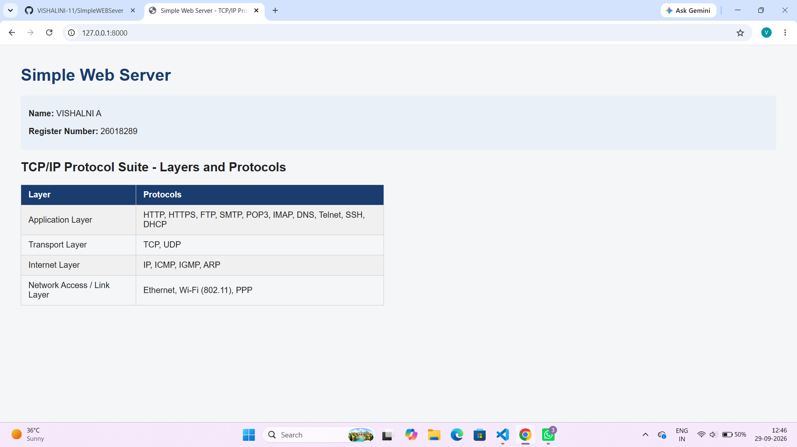
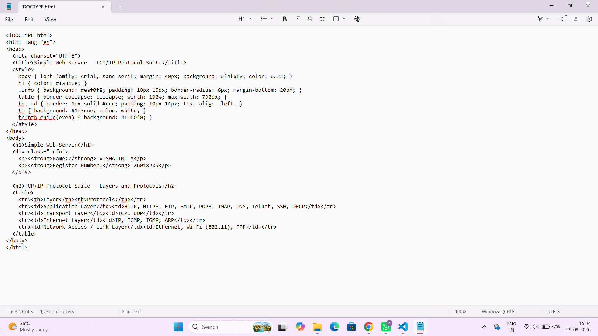

# SImpleWEBSever
# EX01 Developing a Simple Webserver
## Date:29.09.2026

## AIM:
To develop a simple webserver to serve html pages and display the Device Specifications of your Laptop.

## DESIGN STEPS:
### Step 1: 
HTML content creation.

### Step 2:
Design of webserver workflow.

### Step 3:
Implementation using Python code.

### Step 4:
Import the necessary modules.

### Step 5:
Define a custom request handler.

### Step 6:
Start an HTTP server on a specific port.

### Step 7:
Run the Python script to serve web pages.

### Step 8:
Serve the HTML pages.

### Step 9:
Start the server script and check for errors.

### Step 10:
Open a browser and navigate to http://127.0.0.1:8000 (or the assigned port).

## PROGRAM:
"""
Simple Web Server
Serves an HTML page listing the TCP/IP Protocol Suite.
Runs on 127.0.0.1:8000
"""

from http.server import HTTPServer, SimpleHTTPRequestHandler
import os

HOST = "127.0.0.1"
PORT = 8000

class Handler(SimpleHTTPRequestHandler):
    def do_GET(self):
        if self.path == "/" or self.path == "":
            self.path = "/index.html"
        return super().do_GET()

if __name__ == "__main__":
    os.chdir(os.path.dirname(os.path.abspath(__file__)))
    server = HTTPServer((HOST, PORT), Handler)
    print(f"Serving on http://{HOST}:{PORT}  (Press Ctrl+C to stop)")
    try:
        server.serve_forever()
    except KeyboardInterrupt:
        print("\nServer stopped.")
        server.server_close()

## OUTPUT:

## RESULT:
The program for implementing simple webserver is executed successfully.
